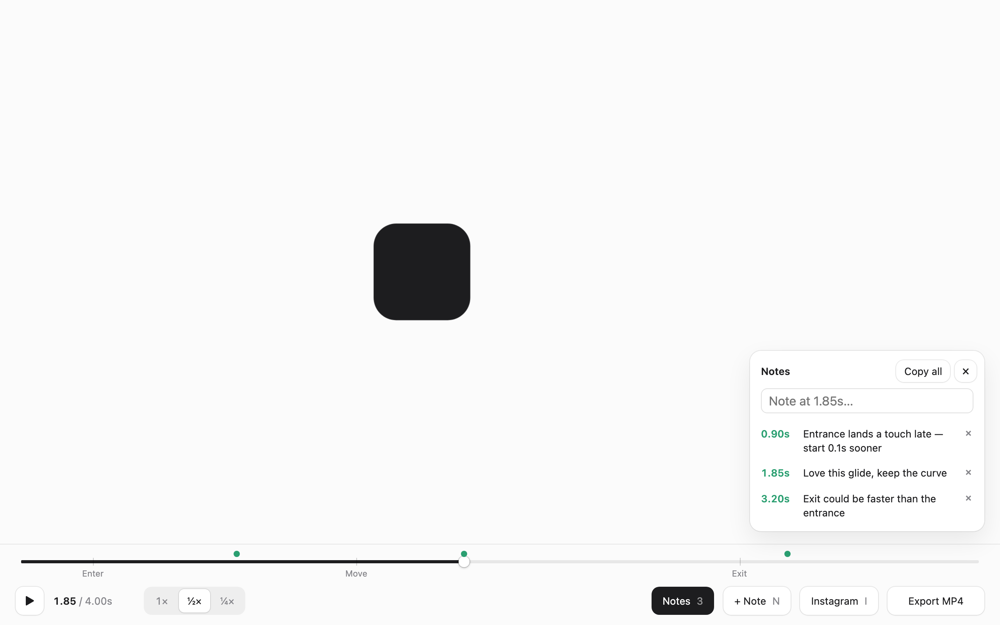
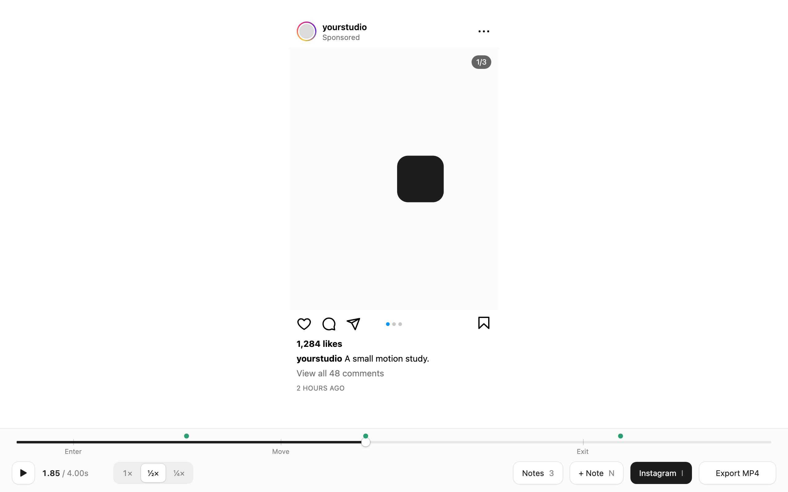
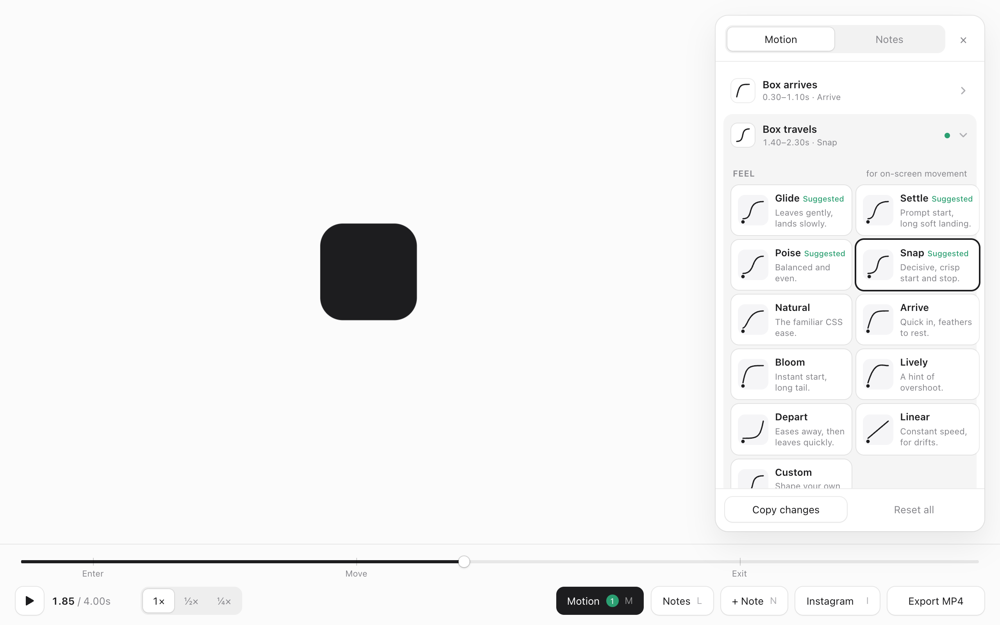

# motion-review

An agent skill for building and reviewing timeline animations — loops, showreel and case-study motion,
social posts — with a review harness that lets people leave **timestamped notes** and export a **frame-exact MP4**.





## What you get

- **Review bar** (`assets/review-bar.js`) — drop-in UI on two rows, plus a **Motion** panel for tuning transitions: a full-width scrubber labelled with your
  animation's beats, then play/pause, timecode, **1× · ½× · ¼×** speed, a notes panel you can show or hide
  (the animation is refitted beside it, never covered), notes pinned to the current moment (**N**), **Copy all**
  as `1.85s — note` lines to paste to your agent, an **Instagram** feed-post preview (**I**), and **Export MP4**.
- **Player** (`assets/anim-player.js`) — a deterministic clock around one pure `render(t)` function: loop,
  pause, seek, review speed, shareable `?t=` / `?speed=` links, native `<video>` kept in sync without hitches,
  and hooks for frame-exact export.
- **Scripts** — `serve.py` (static server with range requests for video + local-only export endpoint),
  `export.py` + `encode.swift` (60fps, 2× supersampled H.264 via AVFoundation, no ffmpeg),
  `framecheck.py` (frames at timestamps, loop-seam check, pop/jitter scan, video contact sheets).
- **Guidance** (`SKILL.md`, `references/notes-workflow.md`) — how the agent should build animations for review
  and turn notes like *"3.94s — this pause was too long"* into precise, verified changes.

## Tune the motion — no motion background needed



Press **M** (or **Motion**) for the animation's key transitions, each as a card. Open one and the playhead jumps to it:

- **Feel** — curated curves with plain names and a live preview on hover: *Glide*, *Settle*, *Poise*, *Snap* for
  movement; *Arrive*, *Bloom*, *Lively* for entrances; *Depart* for exits; *Natural*, *Linear*. The right ones for the
  transition are marked *Suggested*.
- **Custom** — drag the curve's two handles (overshoot allowed) or type `cubic-bezier` values; a dot shows the motion.
- **Timing** — *Duration* (quicker ↔ slower) and *Starts* (earlier ↔ later).
- **Style** — for swaps: *Wipe*, *Slide*, *Dissolve*, *Rise*.
- **Preview this** — loops just that transition (with ½× / ¼× for detail).

Changes apply live, are remembered, go into **Export MP4**, and **Copy changes** turns them into a plain-language list
to hand to your agent, which bakes them into the code. Declare tunable transitions with `player.tune({...})` (see SKILL.md).

## Instagram preview

**Instagram** (or **I**) frames the artboard as a light-mode 4:5 feed post — header, carousel counter and dots,
like/comment/share/save, likes, caption — so you can judge the motion where it will actually be seen. It cycles
**off → White → Black**: a white page with the post as a softly shadowed card, or a black surround that makes the
post's edges unmistakable. Configure it per project:

```js
ReviewBar.mount(player, {
  storageKey: 'my-anim-notes',
  instagram: { handle: 'yourstudio', subtitle: 'Client', caption: 'One line about the work.', likes: '1,284', comments: 48, slides: 4 },
});
```

## Keys and links

| Key | Action |
| --- | --- |
| Space | Play / pause |
| ← / → | Step one frame (Shift: 0.5s) |
| 1–9 | Jump to keyframes |
| M | Motion panel: tune key transitions |
| N | Note at this moment (opens the notes panel) |
| L | Show / hide notes |
| I | Instagram preview: off → White → Black |
| S | Speed: 1× → ½× → ¼× |

Shareable URL params: `?t=4.2` (freeze on a moment), `?speed=0.5`, `?ig=light` / `?ig=dark`, `?clean` (no UI, for
screen recording), `?actual` (1:1 pixels). Notes are stored per viewer — remote reviewers use **Copy all** and send the text.

## Tools

```bash
python3 tools/serve.py 5178                               # serve the page (video-safe) + export endpoint
python3 tools/framecheck.py sheet 2.4,2.55,2.7            # frames at timestamps (use on every note)
python3 tools/framecheck.py crop 1.31 100,450,880,450     # zoom into a region at a moment
python3 tools/framecheck.py seam                          # is the loop seamless? (mean ≈ 0)
python3 tools/framecheck.py steps 30                      # find pops / jumps / hard cuts
python3 tools/framecheck.py clip assets/clip.mp4 24       # contact sheet of a video, to pick in-points
python3 tools/export.py --fps 60 --scale 2                # frame-exact H.264 MP4
```

Rendering uses full Chromium (new headless): Playwright's default headless shell silently drops `backdrop-filter`,
so frosted-glass elements would export unblurred.

`references/techniques.md` has copy-ready code for the patterns reviewers kept asking for: shrinking rounded crops,
a camera locked on the subject, a film that glides to a stop, directional menu wipes, seamless loops, squircle
corners and strokes, and baked shadows.

## Install

Copy the folder into your agent's skills directory, e.g. for Claude Code:

```bash
git clone https://github.com/lymanballif/motion-review ~/.claude/skills/motion-review
```

Then ask your agent to build an animation, or paste it timestamped notes — the skill takes it from there.
See the [template](assets/template.html) for a minimal page.

## Requirements

- A browser for reviewing; Python 3 for the server.
- For `framecheck.py` / export: `pip install playwright && playwright install chromium`.
- For MP4 encoding: macOS with Xcode command line tools (`swift`).

## License

MIT
